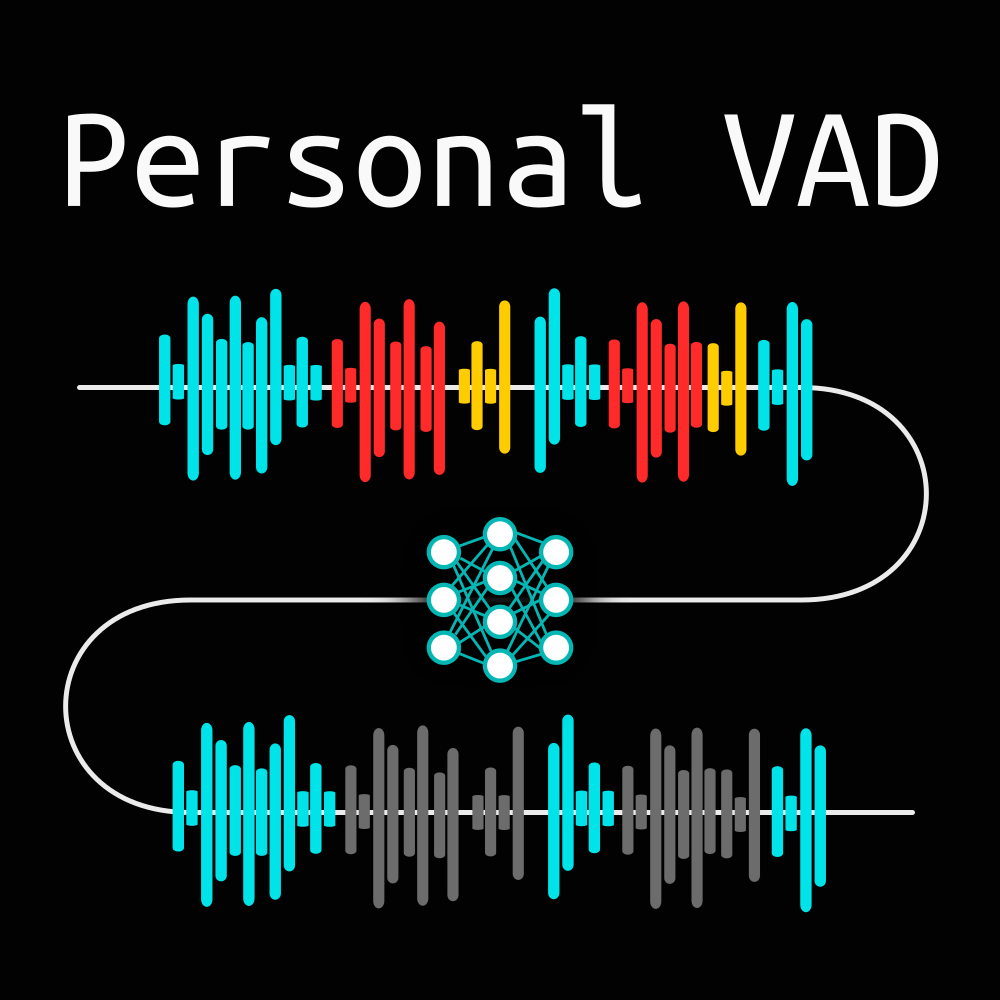

# personalVAD

This is an unofficial implementation of the "Personal VAD" speaker-conditioned VAD method
introduced in the *PersonalVAD: Speaker-Conditioned Voice Activity Detection* paper referenced
below.

This project was done as a part of my bachelor's thesis project:
SEDLÁČEK, Šimon. *Personal Voice Activity Detection.* Brno, 2021. Bachelor’s thesis. Brno University of Technology, Faculty of Information Technology. Supervisor Ing. Ján Švec

#### Paper reference
```
@inproceedings{personalVAD,
    author={Shaojin Ding and Quan Wang and Shuo-Yiin Chang and Li Wan and Ignacio {Lopez Moreno}},
    title={Personal VAD: Speaker-Conditioned Voice Activity Detection},
    year=2020,
    booktitle={Proc. Odyssey 2020 The Speaker and Language Recognition Workshop},
    pages={433--439},
    doi={10.21437/Odyssey.2020-62},
    url={https://arxiv.org/abs/1908.04284}}
```
Ding, S.,Wang, Q.,Chang, S.-Y.,Wan, L. andLopez Moreno, I. *PersonalVAD: Speaker-Conditioned Voice Activity Detection.* In:Proc. Odyssey 2020 TheSpeaker and Language Recognition Workshop. 2020, p. 433–439. DOI:10.21437/Odyssey.2020-62. Available at: https://arxiv.org/abs/1908.04284.

## Repo structure

#### Directory structure
* `src/` -- contains all the personal VAD model definitions, training scripts, utterance
        concatenation, and and feature extraction scripts. 
    * `src/kaldi/` -- contains the Kaldi-specific project files used for data augmentation.
            These will be copied to `kaldi/egs/pvad/` once Kaldi is set up.
* `doc/` -- contains the personal VAD thumbnail image and text files with the evaluation
        results for all trained models both for clean and augmented speech
* `data/` -- directory containing the resources for training and evalutaion. Here, the
        LibriSpeech dataset sample is situated along with its alignments. This will also be
        the directory, where the extracted features will be situated once the feature
        extraction process is done.
    * `data/embeddings/` -- this directory contains pre-computed d-vector speaker embeddings for
            all speakers in the LibriSpeech corpus, used by the feature extraction scripts.
    * `data/eval_dir/` -- this directory contains the necessary resources used by the model
            evaluation scripts
        * `data/eval_dir/models/` -- contains all pre-trained personal VAD models.
        * `data/eval_dir/embeddings*/` -- contains pre-computed LibriSpeech speaker
                embeddings (d-vectors, x-vectors, i-vectors) for evaluation purposes.
        * `data/eval_dir/data/`-- contains the sample evaluation dataset use by the evaluation scripts.

#### Scripts and other notable files
* `prepare_dataset_features.sh` -- run data preparation and feature extraction.
* `prepare_kaldi_dir.sh` -- use this script to prepare the Kaldi project folder after Kaldi
        is set up and compiled.
* `train_pvad.sh` -- use this script to launch demonstration model training.
* `xsedla1h_thesis.pdf/.zip` -- the thesis `.pdf` file and the `.zip` file with the LaTeX sources.
* `requirements.txt` -- a list of Python dependencies required by the project.

## Instructions
IMPORTANT! Before running any of the data prep or evaluation scripts, please make sure that
you have a cuda-compatible GPU available on the current system. Otherwise, both feature
extraction and model evaluation will take much longer to execute.
All scripts are meant to be run from the *repository root folder*.

### Trained models and sample dataset
You can download an ~800MB version of this repository, which contains all the trained
models and a small demo dastaset from this address: https://nextcloud.fit.vutbr.cz/s/xSRBxZmmAJJMHNe

### Prerequisites
Before using any of the included software, please make sure to download all the necessary Python
dependencies.

To ensure correct dependency installation, one can use conda virtual environments.
For this purpose, please make sure you have Anaconda installed. If you need to install conda,
visit for example: https://conda.io/projects/conda/en/latest/user-guide/install/index.html.

After conda is installed and configured, we need to create and activate a new virtual environment:
```
conda create -n personal_vad python=3.7
conda activate personal_vad
```

From here, we can install the necessary dependencies:
```
pip install -r requirements.txt
```

Of course, it is possible install the dependencies without conda. However, using virtual
is a neat way to ensure portability and avoid package conflicts.

Requires Python version 3.7 or newer.

### Installing and using Kaldi for data augmentation
This step is purely **OPTIONAL**.
Augmentation will require additional **16GB of disk space**, since the MUSAN and rirs_noises corpuses have to be downloaded.

In order to fully utilize the feature extraction pipeline, please install the Kaldi
Speech Recognition Toolkit in the **root directory** of this project. After downloading Kaldi,
please compile the toolkit, as the augmentation process will need some of the Kaldi binaries. More
information can be found at: https://kaldi-asr.org/

Once Kaldi is compiled, please run the following script:
```
$ bash prepare_kaldi_dir.sh
```
This script will prepare the project folder in ``kaldi/egs/pvad``, copy some required script files
from `src/kaldi/egs/pvad/` and create necessary symlinks to Kaldi binaries and utilities.

If you now wish to run data augmentation along with feature extraction, in
`prepare_dataset_features.sh`, change the `AUGMENT` variable to `true`. The generated dataset
will now be augmented before feature extraction. If you wish to alter the augmentation parameters,
go to the `kaldi/egs/pvad/` directory and see the `reverberate_augment.sh` script.

### Running data preparation and feature extraction
There is one LibriSpeech subset enclosed in the ``data/`` directory: `dev-clean`, respectively
its `.tar.gz` archive. Additionally, there is a `.zip` file containing LibriSpeech
alignment information.
After extracting the archives, other LibriSpeech subset directories will also be visible, however,
they only contain the alignment files obtained from https://zenodo.org/record/2619474. You need to
download the other LibriSpeech subsets from https://www.openslr.org/12 and extract them
in the ``data/`` directory in case you wish to use them.

Before running the data preparation and feature extraction processes, please take a look
at the ``prepare_dataset_features.sh`` script. In the preamble, this script contains a few
configuration options, for example which LibriSpeech subsets are to be used, whether to
perform data augmentation or how many CPU workers to use for feature extraction multiprocessing.

By default, one can simply run:
```
$ bash prepare_dataset_features.sh 0
```
This will run a demonstration version of data preparation and feature extraction without
augmentation. The generated demonstration datset will consist of 500 unique concatenated
utterances from the ``dev-clean`` subset and will be situated in `data/features_demo` once the
feature extraction process is done.

### Running model training
To train a personal VAD model using the sample features in `data/eval_dir/data/`, please see
the ``train_pvad.sh`` script. This script contains examples of runnning the python model
training scripts and will guide you if you wish to train your own model on your own data.
The script can be run for example as:
```
$ bash train_pvad.sh et
```
where `et` is the PVAD architecture name specification. Other alternatives are `vad`, `st`, `set`.

### Running model evaluation 
There are two tools to evaluate the trained models in this repository.
The first is the `src/evaluate_models.py` script, which will take the sample validation data in
the `data/eval_dir/data/` directory and will run evaluation on all models present in
the `data/eval_dir/models/` directory (the whole process is quite time-consuming and a GPU is
absolutely crucial here). The evaluation results are written to standard output.
It can be run for example as:
```
$ python src/evaluate_models.py
```

 To evaluate each model individually, the `src/personal_vad_evaluate.ipynb` notebook can be used,
 providing better control over the evaluation process. The notebook NEEDS access to
 the `data/eval_dir/` directory to work correctly -- to ensure this, simply run the notebook
 inside the `src/` directory.
